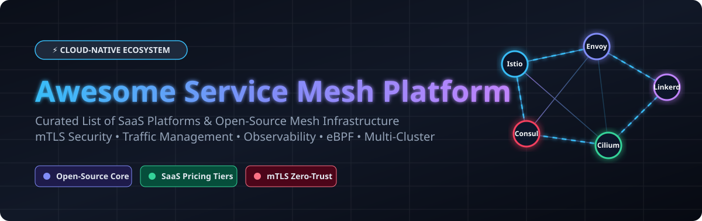

# 🕸️ Awesome Service Mesh Platform Ecosystem

<p align="center">
  <a href="https://github.com/ishandutta2007/Awesome-Awesome-Awesome"></a>
  <a href="https://discord.gg/jc4xtF58Ve"></a>
  <a href="https://github.com/ishandutta2007/Awesome-Service-Mesh-Platform/stargazers"></a>
  <a href="https://github.com/ishandutta2007/Awesome-Service-Mesh-Platform/network/members"></a>
  <a href="https://github.com/ishandutta2007/Awesome-Service-Mesh-Platform/issues"></a>
  <a href="https://github.com/ishandutta2007/Awesome-Service-Mesh-Platform/blob/main/LICENSE"></a>
  <a href="https://github.com/ishandutta2007"></a>
</p>

<p align="center">
  
</p>

## 🚀 Curated Guide to SaaS / Managed Platforms & Open-Source Microservice Infrastructure

> **SEO Overview**: A comprehensive, production-tested directory of **Service Mesh platforms**, **managed SaaS solutions**, and **open-source microservice networking projects**. Master **Istio (Ambient Mesh)**, **Linkerd**, **Envoy Proxy**, **Cilium (eBPF)**, and **Consul** for zero-trust mTLS security, L7 traffic management, distributed tracing, and multi-cluster Kubernetes observability.

---

## 📌 Table of Contents

- [☁️ SaaS / Managed Platforms](#️-saas--managed-platforms)
- [📊 Market Size & Industry Fragmentation Analysis](#-market-size--industry-fragmentation-analysis)
- [🔓 Open-Source GitHub Projects](#-open-source-github-projects)
- [⚙️ Feature Comparison & Architecture Patterns](#️-feature-comparison--architecture-patterns)
- [🤝 How to Contribute](#-how-to-contribute)
- [📜 Disclaimer](#-disclaimer)
- [📈 Star History](#-star-history)

---

## ☁️ SaaS / Managed Platforms

### 📊 Market Size & Industry Fragmentation Analysis

> 💡 **Market Size & Structure**: The global **Service Mesh Market** is estimated at **~$1.4 Billion in 2026** and is projected to reach **$4.8 Billion+ by 2030** (growing at a CAGR of ~28%). The market is currently **moderately to highly fragmented**: while open-source projects (Istio, Envoy, Cilium) define the standard data plane layer, commercial enterprise offerings are fragmented across cloud hyperscalers (AWS, Google Cloud), enterprise infrastructure monoliths (IBM/Red Hat, HashiCorp), and hyper-specialized security/multi-cluster startups (Solo.io, Tetrate, Buoyant).

The table below details commercial SaaS & enterprise service mesh offerings, sorted by **Company Size (Valuation / Revenue)** in descending order:

| Platform / SaaS Product | Company Size (Valuation / Revenue) | Description | Pricing (Starting Tier) | Free Tier / Trial Limits |
| :--- | :--- | :--- | :--- | :--- |
| **[Google Cloud Service Mesh](https://cloud.google.com/service-mesh)** | **~$2.1 Trillion** (Alphabet Valuation) / **~$330B+** Rev | Fully managed Istio control plane and telemetry engine for GKE and Cloud Run. | **$0.0006945 / client hr** (~$0.50 / client pod / mo) | **90-day free trial** with **$300 credits** for new Google Cloud accounts |
| **[AWS App Mesh](https://aws.amazon.com/app-mesh/)** | **~$2.0 Trillion** (Amazon Valuation) / **~$600B+** Rev | Managed service mesh from AWS standardizing traffic across ECS, EKS, and EC2 via Envoy proxies. | **$0 / Free** (Pay only for underlying EC2/Fargate/EKS infrastructure) | **Free forever** for App Mesh API; underlying compute eligible for AWS 12-Month Free Tier |
| **[Red Hat OpenShift Service Mesh](https://www.redhat.com/en/technologies/cloud-computing/openshift/what-is-service-mesh)** | **~$180 Billion** (IBM Market Cap / $34B Red Hat acquisition) | Enterprise Istio, Kiali, and Jaeger distribution integrated into Red Hat OpenShift Container Platform. | Included in OpenShift subscription (**~$0.08 / vCPU hr** or **~$1,000 / node / yr**) | **60-day free trial** of Red Hat OpenShift Container Platform |
| **[HashiCorp HCP Consul](https://cloud.hashicorp.com/products/consul)** | **~$6.4 Billion** ($6.4B IBM Acquisition) | Fully managed Consul service mesh on HashiCorp Cloud Platform for multi-cloud mTLS segmentation. | **$0.027 / hour** (~$20 / mo) for Dev cluster; **$0.069 / hr** + $0.03 / instance / hr for Standard | **$500 free trial credits** upon creating an HCP account |
| **[Kong Konnect / Kong Mesh](https://konghq.com/kong-mesh)** | **~$2.0 Billion+** Valuation (Unicorn / $100M+ ARR) | Enterprise SaaS control plane based on Kuma, delivering multi-cluster security and service governance. | **$250 / month** (Konnect Plus starting tier; includes 1M requests/mo + 2 hybrid gateways) | **30-day free trial** with full enterprise features and unlimited gateway instances |
| **[Solo.io Gloo Mesh](https://www.solo.io/products/gloo-mesh/)** | **~$1.0 Billion+** Valuation (Unicorn, Series C) | Enterprise management plane and multi-cluster control plane for Istio, Envoy, and Cilium. | Enterprise starter contracts from **~$19,000 / year** (AWS Marketplace contract tier) | **30-day evaluation trial license** key via Solo.io developer portal |
| **[Tetrate Service Bridge / TSE](https://tetrate.io/)** | **~$150 Million+** Valuation ($52.5M+ raised) | Enterprise multi-cluster Istio & Envoy management platform for multi-cloud zero-trust governance. | **$0** (Tetrate Istio Distribution); Enterprise packages from **$19,000 / year** | **Free forever** for Tetrate Istio Distribution (TID); **30-day evaluation trial** for TSE |
| **[Buoyant Enterprise for Linkerd](https://buoyant.io/)** | **~$50 Million+** Valuation ($15.5M+ raised) | Commercial distribution and cloud management for Linkerd with security hardening and 24/7 support. | **$0 / Free** for organizations with <50 employees; paid enterprise plans for 50+ employees | **Free forever** for organizations with <50 employees (unlimited production pods/clusters) |

---

## 🔓 Open-Source GitHub Projects

Below is a curated list of top open-source Service Mesh and microservice networking projects, sorted by **GitHub Star Count** in descending order. Click on any star badge to inspect stargazers on GitHub!

| Open-Source Project | GitHub Star Badge | Description | Primary Data Plane / Stack |
| :--- | :--- | :--- | :--- |
| **[Traefik / Traefik Mesh](https://github.com/traefik/traefik)** | <a href="https://github.com/traefik/traefik/stargazers"></a> | Cloud-native L7 edge router and lightweight service mesh designed for automatic container discovery. | Traefik Proxy / Go |
| **[Envoy Proxy](https://github.com/envoyproxy/envoy)** | <a href="https://github.com/envoyproxy/envoy/stargazers"></a> | High-performance C++ L7 proxy and service bus powering Istio, Consul, AWS App Mesh, and Gloo. | Envoy C++ |
| **[Istio](https://github.com/istio/istio)** | <a href="https://github.com/istio/istio/stargazers"></a> | De facto industry standard open-source service mesh providing mTLS, L7 routing, telemetry, and Ambient Mesh. | Envoy Sidecars & Ambient (ztunnel/eBPF) |
| **[HashiCorp Consul](https://github.com/hashicorp/consul)** | <a href="https://github.com/hashicorp/consul/stargazers"></a> | Multi-datacenter service networking and service mesh supporting Kubernetes, VMs, and bare-metal workloads. | Envoy Proxy & Native Proxy |
| **[Cilium Service Mesh](https://github.com/cilium/cilium)** | <a href="https://github.com/cilium/cilium/stargazers"></a> | eBPF-powered kernel-level networking, security, and sidecarless service mesh integrated with Kubernetes CNI. | eBPF Kernel / Envoy Proxy |
| **[Linkerd2](https://github.com/linkerd/linkerd2)** | <a href="https://github.com/linkerd/linkerd2/stargazers"></a> | CNCF graduated, ultralight service mesh focused on operational simplicity and Rust microproxy performance. | Linkerd2-proxy (Rust) |
| **[Kuma](https://github.com/kumahq/kuma)** | <a href="https://github.com/kumahq/kuma/stargazers"></a> | CNCF universal service mesh built on Envoy, delivering multi-zone and hybrid cloud connectivity across K8s & VMs. | Envoy Proxy |
| **[Open Service Mesh (OSM)](https://github.com/openservicemesh/osm)** | <a href="https://github.com/openservicemesh/osm/stargazers"></a> | Lightweight CNCF Envoy-based service mesh adhering strictly to Service Mesh Interface (SMI) specifications. | Envoy Proxy |
| **[SPIFFE / SPIRE](https://github.com/spiffe/spire)** | <a href="https://github.com/spiffe/spire/stargazers"></a> | Production implementation of SPIFFE APIs issuing automated X.509 mTLS workload identity certificates across meshes. | Workload Identity Framework |
| **[Merbridge](https://github.com/merbridge/merbridge)** | <a href="https://github.com/merbridge/merbridge/stargazers"></a> | eBPF-based network accelerator designed to bypass iptables latency in Istio and Linkerd service meshes. | eBPF Kernel Bypass |
| **[Service Mesh Interface (SMI)](https://github.com/servicemeshinterface/smi-spec)** | <a href="https://github.com/servicemeshinterface/smi-spec/stargazers"></a> | Standard specification for service meshes on Kubernetes covering traffic spec, split, access control, and metrics. | Standard Specification |
| **[Aeraki Mesh](https://github.com/aeraki-mesh/aeraki)** | <a href="https://github.com/aeraki-mesh/aeraki/stargazers"></a> | Extends Istio service mesh to support non-HTTP protocols (Dubbo, Thrift, Redis, Kafka, proprietary protocols). | Envoy Protocol Extensions |

---

## ⚙️ Feature Comparison & Architecture Patterns

```
+-------------------------------------------------------------------+
|                     APPLICATIONS / PODS                           |
+-------------------------------------------------------------------+
|  Sidecar Proxy (Envoy / Linkerd-proxy) OR eBPF Kernel Layer (Cilium)|
+-------------------------------------------------------------------+
|  - Automatic mTLS Encryption & Identity (SPIFFE/SPIRE)             |
|  - L7 Traffic Splitting, Canary Deployments & Fault Injection    |
|  - Distributed Tracing (Jaeger, Zipkin) & Prometheus Metrics       |
+-------------------------------------------------------------------+
|                     CONTROL PLANE MANAGEMENT                      |
|  (Istio istiod / Kuma Control Plane / Gloo Mesh / HCP Consul)     |
+-------------------------------------------------------------------+
```

- **Istio (Ambient Mesh)**: Offers sidecarless ztunnel L4 mTLS and optional L7 Waypoint proxies.
- **Linkerd**: Uses custom Rust proxies (`linkerd2-proxy`) for maximum security and minimal memory footprint.
- **Cilium**: Bypasses TCP stack overhead using Linux eBPF socket programs for near line-rate speed.

---

## 🤝 How to Contribute

1. Fork the repository.
2. Add or update entries in `README.md` maintaining the tabular format.
3. Ensure to include official URLs, exact pricing details, free tier limits, and accurate GitHub star badges.
4. Submit a Pull Request! Reference our main awesome list at [Awesome-Awesome-Awesome](https://github.com/ishandutta2007/Awesome-Awesome-Awesome).

---

## 📜 Disclaimer

- This is a **community-curated** list — not an official endorsement.
- Service meshes sit in the critical path of application traffic. Thorough testing, progressive rollout, and proper observability are mandatory.

---

## 📈 Star History

[](https://star-history.dera.page/#ishandutta2007/Awesome-Service-Mesh-Platform&type=date&legend=top-left)

---

<p align="center">
  <b>Made with ❤️ for Platform Engineers, SREs, and Cloud-Native Architects</b>
</p>
